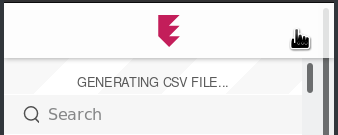

# Encryptr to Bitwarden

I really like you, Encryptr, but it's time to say goodbye.

## How to use

### Install Encryptr from Github master branch

Unless Encryptr has been officially updated after the time of writing (unlikely), you'll need to get the latest version of `master` locally.

See [this link](https://github.com/SpiderOak/Encryptr/issues/295#issuecomment-322449705) for a tutorial. You can either download the files that @hnykda has linked (I didn't try this), or build it from source. To do this, follow the steps in the link with a few modifications:

* Skip step 6. Instead, edit `build.sh` and replace all `grunt` invocations with `./grunt`.
* Skip step 8.

### Get CSV export

I found that some buttons were invisible on my machine. However, the export to CSV button is in the top right of the main screen:

Wait for the CSV to be generated. It will probably take a long time. When it's ready, it'll prompt you to save the CSV export.

### Convert

`./convert.py export.csv`

### Import into Bitwarden

Head to https://vault.bitwarden.com/#/tools/import and log in. Select "Bitwarden (json)" as the format and upload your converted file.

## Notes

* This script works best on a completely empty Bitwarden vault, because anything in the import file will be added to your vault, even if it's a duplicate of an existing item.

* This script worked for me. However, I did make several assumptions about how Bitwarden works. My work is probably not perfect, and plenty of cases have not been tested.
